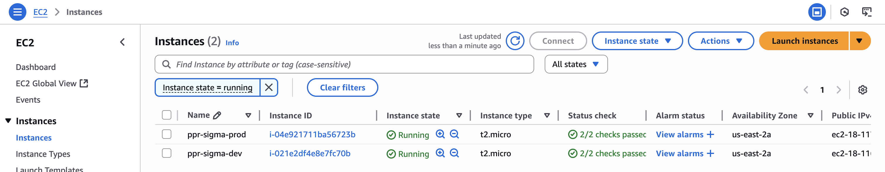

# ☁ AWS Module – PPR Project

This module contains a **Spring Boot application** that is:

- **Containerized with Docker**
- **Deployable on AWS**
- **Environment-aware**, simulating different application behaviors using the `APP_ENV` variable (e.g., `dev`, `prod`)

---

## 🐳 Docker

### 🔧 Building the Docker Image

Make sure Docker is installed and running, then build the image with:

```bash
docker build -t ppr-aws-app .

# Run in development mode
docker run -e APP_ENV=dev -p 8080:8080 ppr-aws-app

# Run in production mode
docker run -e APP_ENV=prod -p 8080:8080 ppr-aws-app
```

## ☁ AWS

### Application deployed on AWS EC2 service (free tier)


### Dev environment:
- http://18.116.87.175:8080/environment

### Prod environment:
- http://18.117.77.87:8080/environment

